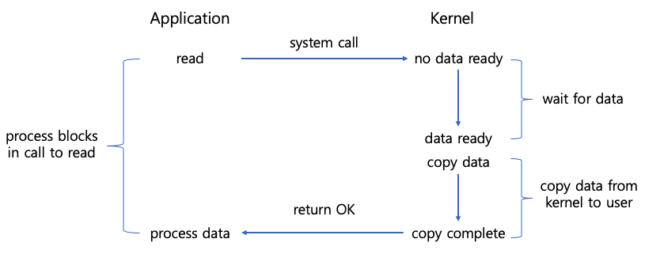
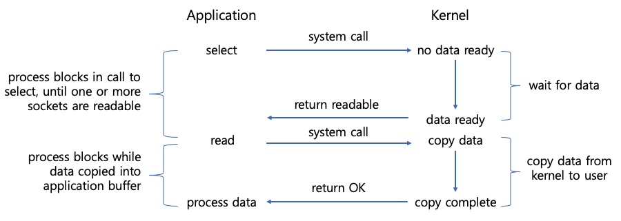
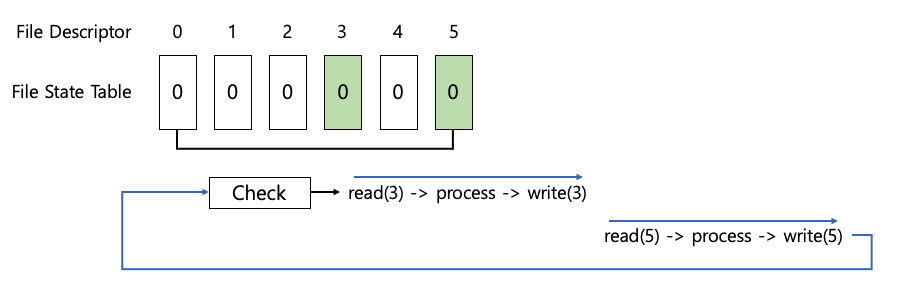

# 멀티플렉싱 기반 다중 접속 통신
멀티플렉싱은 각 클라이언트마다 별도 스레드를 이용하는 게 아니라, 하나의 스레드에서 다수의 클라이언트에 연결된 소켓(파일 디스크립터)을 관리하면서 소켓에 이벤트(read/write)가 발생할 때만 해당 이벤트를 처리하도록 구현함으로써 더 적은 리소스를 사용하도록 개선할 수 있다

# blocking I/O 
이는 멀티쓰레드, 멀티프로세싱에서 진행한 방식이다
- read 함수는 커널 공간에 데이터가 도착할 떄까지 대기한다
- 프로세스(스레드)가 하나의 소켓에 대해 read 함수를 호출하면, 데이터가 네트워크를 통해 커널 공간에 도착해 사용자 공간의 프로세스 버퍼에 복사될 때까지 시스템 콜이 반환되지 않는다. (blocking 상태)


# I/O multiplexing 
- 멀티플렉싱 모델에서는 select 함수를 호출해서 여러 개의 소켓 중 read 함수 호출이 가능한 소켓이 생길 때까지 대기한다 
- select의 결과로 read 함수를 호출할 수 있는 소켓의 목록이 반환되면, 해당 소켓들에 대해 read 함수를 호출한다 


# 1. select 
select 방식은 이벤트(입력, 출력, 에러)별로 감시할 파일들을 fd_set이라는 파일 상태 테이블(파일 디스크립터 비트 배열)에 등록하고, 등록된 파일(파일 디스크립터)에 이벤트가 발생하면 fd_set을 확인하는 방식으로 작동한다

- 6개의 파일을 다뤄야 할 때, 6개의 파일에 대해 입출력 데이터가 준비될 때까지 이벤트를 기다리는 파일 상태 테이블을 준비한다
- 그 후 6개의 파일 중 입출력이 준비된 파일에 대한 이벤트가 발생하면 이벤트가 발생한 파일 디스크립터의 수를 반환한다
- 이후 이벤트가 준비된 파이렝 대해 입출력을 수행한다. 여기서 이미 데이터가 준비된 파일에 대해 입출력을 수행하기 때문에 무한정 대기해야 하는 블록이 발생하지 않는다. 

```
int select(int nfds, fd_set *readfds, fd_set *writefds, fd_set *exceptfds, struct timeval *timeout)
```
- nfds: 검사 대상 파일 디스크립터의 수
- readfs: 읽기 이벤트를 검사할 파일 디스크립터 목록
- writefds: 쓰기 이벤트를 검사할 파일 디스크립터 목록
- exceptfds: 예외 이벤트를 검사할 파일 디스크립터 목록
- timeout: 이벤트를 기다릴 시간 제한
- 반환 값: 이벤트가 발생한 파일의 갯수


## 장점
- 단일 프로세스(스레드)에서 여러 파일의 입출력 처리가 가능한 덕분에 동시에 수만 개의 커넥션도 처리할 수 있 (C10k problem을 해결)
- POSIX 표준을 따르기 때문에 지원하는 운영 체제가 많아 이식성이 좋음 
- 클라이언트 요청마다 처리하기 위한 별도 스레드를 만들지 않기 때문에 컨텍스트 전환(context switching) 오버헤드가 발생하지 않음 

## 단점	
- select 함수를 호출해서 전달된 정보는 커널에 등록되지 않은 것이기 때문에 select 함수를 호출할 때마다 매번 관련 정보를 전달해야 한다 
- select 함수의 호출 결과가 이벤트가 발생한 파일 디스크립터의 개수이기 때문에 어떤 파일 디스크립터에서 이벤트가 발생했는지 확인하기 위해서는 매번 fd_set 테이블 전체를 검사해야 한다 O(n)
- 검사할 수 있는 파일 디스크립터 개수에 제한이 있다(최대 1024개)
- select 함수를 호출할 때마다 데이터를 복사해야 한다 (select 함수를 호출한 후 이벤트를 처리할 때 fd_set 테이블 변경이 필요하기 때문에 미리 복사가 필요하다)

## select server 
```
> ./echo_multiplex_server 3000

# 연결시
connected client: 4
connected client: 5

# 연결 종료시 
client disconnected...
client disconnected...
```

<br>

## client1
```
> ./echo_client 127.0.01 3000
Connected...........
Input message(Q to quit): 123
Message from server: 123
```

<br>

## client2
```
> ./echo_client 127.0.0.1 3000
Connected...........
Input message(Q to quit): 456
Message from server: 456

```

<br>

# 2. poll
poll도 select와 마찬가지로 멀티플렉싱을 구현하는 시스템 콜. poll이 여러 개의 파일을 다루는 방법은 select와 같다.
- 파일 디스크립터의 이벤트를 기다리다가 이벤트가 발생하면, poll에서의 블록이 해제되고 어떤 파일 디스크립터에 이벤트가 발생했는지 검사한다

```
#include <poll.h>

struct pollfd {
    int   fd;         /* file descriptor */
    short events;     /* requested events */
    short revents;    /* returned events */
};         

int poll (struct pollfd *fds, nfds_t nfds, int timeout);
```

## 장점 
- select와 같이 단일 프로세스(스레드)에서 여러 파일의 입출력 처리가 가능하다
- select는 fd_set을 계속 제공해야 하지만, poll은 관심있는 fd에 대해서만 pollfd 구조체 배열로 전달 가능하다
- select는 timeval이라는 구조체를 사용해 타임아웃 값을 설정하지만, poll은 별다른 구조체 없이 타임아웃을 설정할 수 있다

## 단점	
- 일부 UNIX 시스템은 poll을 지원하지 않는다
- select와 같이 O(n)으로 전체 데이터를 탐색한다


# 3. epoll (for Linux)
epoll은 select와 poll의 단점을 해결할 수 있는 멀티플렉싱을 지원한다. 비슷한 역할을 하는 시스템 콜로 Windows에는 IOCP, FreeBSD에서는 Kqueue가 있습니다.
- 커널에 관찰 대상에 대한 정보를 한 번만 전달하고, 관찰 대상의 범위나 내용에 변경이 있을 때에만 변경 사항을 알려준다 

## 장점	
- 상태 변화를 확인하기 위한 전체 파일 디스크립터 대상 반복문이 필요 없다. 즉, O(1)로 처리가 가능하다.
- select 함수에 대응하는 epoll_wait 함수를 호출할 때 커널에서 상태 정보를 유지하기 때문에 관찰 대상의 정보(fd_set)를 매번 전달할 필요가 없다

## 단점	
- 호환성 부족: Linux의 select 기반 서버를 Window의 select 기반 서버로 변경하는 것은 비교적 간단하나, Linux의 epoll 기반의 서버를 Windows의 IOCP 기반으로 변경하는 것은 select를 이용하는 것보다 번거롭다.

## epoll_server
```
root@ubuntu1804:~/io# ./echo_epoll_server 3000
connected client: 5
connected client: 6
closed client: 6
connected client: 6
closed client: 6
connected client: 6
closed client: 6
connected client: 6

```

## client 1
```
vagrant@ubuntu1804:~/io$ ./echo_client 127.0.0.1 3000
Connected...........
Input message(Q to quit): 123
Message from server: 123
Input message(Q to quit):
```

## client 2
```
vagrant@ubuntu1804:~/io$ ./echo_client 127.0.0.1 3000
Connected...........
Input message(Q to quit): q
vagrant@ubuntu1804:~/io$ ./echo_client 127.0.0.1 3000
Connected...........
Input message(Q to quit): q
vagrant@ubuntu1804:~/io$ ./echo_client 127.0.0.1 3000
Connected...........
Input message(Q to quit): q
vagrant@ubuntu1804:~/io$ ./echo_client 127.0.0.1 3000
Connected...........
Input message(Q to quit): 456
Message from server: 456
```


# kqueue, epoll, poll, select 성능 벤치마크 
- https://libevent.org/


<br>


---
https://engineering.linecorp.com/ko/blog/do-not-block-the-event-loop-part1#mcetoc_1gdcaies0s