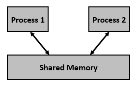

# Shared Memory
- 말 그대로 데이터를 공유한다. 둘 이상의 프로세스 간에 공유되는 메모리이다.
- PIPE, Queue는 통신을 위한 설비라면, 공유 메모리는 데이터 자체를 공유하도록 하는 자원 설비이다
- 프로세스는 자신만의 메모리 영역을 가지고 있다. 다른 프로세스가 접근해서 함부로 데이터를 읽거나 쓰지 못하도록 커널에 의해서 보호된다. 만약 침범하면 커널은 침범 프로세스에 SIGSEGV(경고 시그널) 을 보낸다
- 데이터 통신, 전달하는 방법도 있지만 Thread에서 처럼 메모리 영역을 공유하는 방법을 사용하는 것이 ‘공유 메모리’이다. 

<br>



둘 이상의 프로세스 간에 통신하기 위해 공유 메모리를 사용한다는 것을 알고 있지만 공유 메모리를 사용하기 전에 시스템 호출로 수행해야 하는 작업을 살펴보자
- 공유 메모리 세그먼트를 생성하거나 이미 생성된 공유 메모리 세그먼트를 사용한다 (shmget())
- 이미 생성된 공유 메모리 세그먼트(shmat())에 프로세스를 연결한다 
- 이미 연결된 공유 메모리 세그먼트(shmdt())에서 프로세스를 분리한다 
- 공유 메모리 세그먼트에 대한 작업 제어(shmctl())

<br>

# 명령어
## shmget
해당 system call은 System V 공유 메모리 세그먼트를 생성하거나 할당한다
- 성공 시 유효한 공유 메모리 식별자(공유 메모리의 추가 호출에 사용)를 반환하고 실패 시 -1을 반환한다
```
#include <sys/ipc.h>
#include <sys/shm.h>

int shmget(key_t key, size_t size, int shmflg)
```
- key:  공유 메모리 세그먼트를 인식한다. 키는 임의의 값일 수도 있고 라이브러리 함수 ftok()에서 파생할 수 있는 값일 수도 있다.
- size: 공유 메모리 세그먼트의 크기를 PAGE_SIZE의 배수로 반올림한 값이다.
- shmflg: IPC_CREAT(새 세그먼트 생성) 또는 IPC_EXCL(세그먼트가 이미 존재하는 경우 새 세그먼트를 생성하기 위해 IPC_CREAT와 함께 사용되며 호출이 실패함)과 같은 필수 공유 메모리 플래그를 지정한다. 권한도 전달해야 한다.


## shmat
공유 메모리 세그먼트에 대한 공유 메모리 작업, 즉 호출 프로세스의 주소 공간에 공유 메모리 세그먼트를 연결하는 작업을 수행한다
- 성공 시 연결된 공유 메모리 세그먼트의 주소를 반환하고 실패 시 -1을 반환한다 
```
#include <sys/types.h>
#include <sys/shm.h>

void * shmat(int shmid, const void *shmaddr, int shmflg)
```
- shmid: 공유 메모리 세그먼트의 식별자이다. 이 ID는 공유 메모리 식별자이며, 이는 shmget() 시스템 호출의 반환 값이다.
- shmaddr: 연결 주소를 지정한다. shmaddr이 NULL이면 시스템은 기본적으로 세그먼트를 첨부할 적절한 주소를 선택한다. shmaddr이 NULL이 아니고 SHM_RND가 shmflg에 지정된 경우, 첨부 주소는 SHMLBA(하한 경계 주소)의 가장 가까운 배수 주소와 동일하다. 그렇지 않으면, shmaddr은 공유 메모리 어태치먼트가 발생/시작되는 페이지 정렬 주소여야 한다. 
- shmflg: SHM_RND(SHMLBA로 반올림된 주소), SHM_EXEC(세그먼트의 내용을 실행할 수 있음), SHM_RDONLY(읽기 전용으로 세그먼트를 첨부, 기본적으로 읽기-쓰기), SHM_REMAP(shmaddr에 지정된 범위에서 기존 매핑을 대체하고 세그먼트 끝까지 계속) 등 필요한 공유 메모리 플래그를 지정한다.


## shmdt
호출 프로세스의 주소 공간에서 공유 메모리 세그먼트를 분리하는 시스템 V 공유 메모리 세그먼트에 대한 공유 메모리 연산을 수행한다
- 성공 시 0을 반환하고 실패 시 -1을 반환한다
```
#include <sys/types.h>
#include <sys/shm.h>

int shmdt(const void *shmaddr)
```

## shmctl
공유 메모리 세그먼트에 대한 제어 작업을 수행한다
```
#include <sys/ipc.h>
#include <sys/shm.h>

int shmctl(int shmid, int cmd, struct shmid_ds *buf)
```
- shmid: 공유 메모리 세그먼트의 식별자이다. 이 ID는 공유 메모리 식별자이며, 이는 shmget() 시스템 호출의 반환 값이다. 
- cmd: 공유 메모리 세그먼트에서 필요한 제어 작업을 수행하는 명령이다.
    - IPC_STAT: 구조체 shmid_ds의 각 멤버의 현재 값 정보를 buf가 가리키는 전달된 구조체로 복사한다. 이 명령은 공유 메모리 세그먼트에 대한 읽기 권한이 필요하다.
    - IPC_SET: 구조체 buf가 가리키는 사용자 ID, 소유자의 그룹 ID, 권한 등을 설정한다.
    - IPC_RMID: 파기할 세그먼트를 표시한다. 세그먼트는 마지막 프로세스가 세그먼트를 분리한 후에만 소멸된다.
    - IPC_INFO: buf가 가리키는 구조체의 공유 메모리 제한 및 매개변수에 대한 정보를 반환한다.
    - SHM_INFO: 공유 메모리에 의해 소비된 시스템 리소스에 대한 정보가 포함된 shm_info 구조를 반환한다. 
- buf: 구조체 shmid_ds라는 공유 메모리 구조체에 대한 포인터이다. 이 구조의 값은 cmd에 따라 set 또는 get에 사용된다.


<br>

# shm_write 공유메모리 쓰기
```
> ./shm_write
Writing Process: Shared Memory Write: Wrote 1023 bytes
Writing Process: Shared Memory Write: Wrote 1023 bytes
Writing Process: Shared Memory Write: Wrote 1023 bytes
Writing Process: Shared Memory Write: Wrote 1023 bytes
Writing Process: Shared Memory Write: Wrote 1023 bytes
Writing Process: Wrote 5 times
Writing Process: Complete
```

<br>

# shm_read 공유메모리 읽기 
```
> ./shm_read
segment contains : 
"AAAAAAAAAAAAAAAAAAAAAAAAAAAAAAAAAAAAAAAAAAAAAAAAAAAAAAAAAAAAAAAAAAAAAAAAAAAAAAAAAAAAAAAAAAAAAAAAAAAAAAAAAAAAAAAAAAAAAAAAAAAAAAAAAAAAAAAAAAAAAAAAAAAAAAAAAAAAAAAAAAAAAAAAAAAAAAAAAAAAAAAAAAAAAAAAAAAAAAAAAAAAAAAAAAAAAAAAAAAAAAAAAAAAAAAAAAAAAAAAAAAAAAAAAAAAAAAAAAAAAAAAAAAAAAAAAAAAAAAAAAAAAAAAAAAAAAAAAAAAAAAAAAAAAAAAAAAAAAAAAAAAAAAAAAAAAAAAAAAAAAAAAAAAAAAAAAAAAAAAAAAAAAAAAAAAAAAAAAAAAAAAAAAAAAAAAAAAAAAAAAAAAAAAAAAAAAAAAAAAAAAAAAAAAAAAAAAAAAAAAAAAAAAAAAAAAAAAAAAAAAAAAAAAAAAAAAAAAAAAAAAAAAAAAAAAAAAAAAAAAAAAAAAAAAAAAAAAAAAAAAAAAAAAAAAAAAAAAAAAAAAAAAAAAAAAAAAAAAAAAAAAAAAAAAAAAAAAAAAAAAAAAAAAAAAAAAAAAAAAAAAAAAAAAAAAAAAAAAAAAAAAAAAAAAAAAAAAAAAAAAAAAAAAAAAAAAAAAAAAAAAAAAAAAAAAAAAAAAAAAAAAAAAAAAAAAAAAAAAAAAAAAAAAAAAAAAAAAAAAAAAAAAAAAAAAAAAAAAAAAAAAAAAAAAAAAAAAAAAAAAAAAAAAAAAAAAAAAAAAAAAAAAAAAAAAAAAAAAAAAAAAAAAAAAAAAAAAAAAAAAAAAAAAAAAAAAAAAAAAAAAAAAAAAAAAAAAAAAAAAAAAAAAAAAAAAAAAAAAAAAAAAAAAAAAAAAAAAAAAAAAAAAAAAAAAAAAAAAAAAAAAAAAAAAAAAAAAAAAAAAAAAAAAAAAAAAAAAAAAAAAAAAAAAAAAAAAAAAAAAAAAAAAAAAAAAAAAAAAAAAAAAAAAAAAAAAAAAAAAAAA"
Reading Process: Shared Memory: Read 1023 bytes
segment contains : 
"BBBBBBBBBBBBBBBBBBBBBBBBBBBBBBBBBBBBBBBBBBBBBBBBBBBBBBBBBBBBBBBBBBBBBBBBBBBBBBBBBBBBBBBBBBBBBBBBBBBBBBBBBBBBBBBBBBBBBBBBBBBBBBBBBBBBBBBBBBBBBBBBBBBBBBBBBBBBBBBBBBBBBBBBBBBBBBBBBBBBBBBBBBBBBBBBBBBBBBBBBBBBBBBBBBBBBBBBBBBBBBBBBBBBBBBBBBBBBBBBBBBBBBBBBBBBBBBBBBBBBBBBBBBBBBBBBBBBBBBBBBBBBBBBBBBBBBBBBBBBBBBBBBBBBBBBBBBBBBBBBBBBBBBBBBBBBBBBBBBBBBBBBBBBBBBBBBBBBBBBBBBBBBBBBBBBBBBBBBBBBBBBBBBBBBBBBBBBBBBBBBBBBBBBBBBBBBBBBBBBBBBBBBBBBBBBBBBBBBBBBBBBBBBBBBBBBBBBBBBBBBBBBBBBBBBBBBBBBBBBBBBBBBBBBBBBBBBBBBBBBBBBBBBBBBBBBBBBBBBBBBBBBBBBBBBBBBBBBBBBBBBBBBBBBBBBBBBBBBBBBBBBBBBBBBBBBBBBBBBBBBBBBBBBBBBBBBBBBBBBBBBBBBBBBBBBBBBBBBBBBBBBBBBBBBBBBBBBBBBBBBBBBBBBBBBBBBBBBBBBBBBBBBBBBBBBBBBBBBBBBBBBBBBBBBBBBBBBBBBBBBBBBBBBBBBBBBBBBBBBBBBBBBBBBBBBBBBBBBBBBBBBBBBBBBBBBBBBBBBBBBBBBBBBBBBBBBBBBBBBBBBBBBBBBBBBBBBBBBBBBBBBBBBBBBBBBBBBBBBBBBBBBBBBBBBBBBBBBBBBBBBBBBBBBBBBBBBBBBBBBBBBBBBBBBBBBBBBBBBBBBBBBBBBBBBBBBBBBBBBBBBBBBBBBBBBBBBBBBBBBBBBBBBBBBBBBBBBBBBBBBBBBBBBBBBBBBBBBBBBBBBBBBBBBBBBBBBBBBBBBBBBBBBBBBBBBBBBBBBBBBBBBBBBBBBBBBBBBBBBBBB"
Reading Process: Shared Memory: Read 1023 bytes
segment contains : 
"CCCCCCCCCCCCCCCCCCCCCCCCCCCCCCCCCCCCCCCCCCCCCCCCCCCCCCCCCCCCCCCCCCCCCCCCCCCCCCCCCCCCCCCCCCCCCCCCCCCCCCCCCCCCCCCCCCCCCCCCCCCCCCCCCCCCCCCCCCCCCCCCCCCCCCCCCCCCCCCCCCCCCCCCCCCCCCCCCCCCCCCCCCCCCCCCCCCCCCCCCCCCCCCCCCCCCCCCCCCCCCCCCCCCCCCCCCCCCCCCCCCCCCCCCCCCCCCCCCCCCCCCCCCCCCCCCCCCCCCCCCCCCCCCCCCCCCCCCCCCCCCCCCCCCCCCCCCCCCCCCCCCCCCCCCCCCCCCCCCCCCCCCCCCCCCCCCCCCCCCCCCCCCCCCCCCCCCCCCCCCCCCCCCCCCCCCCCCCCCCCCCCCCCCCCCCCCCCCCCCCCCCCCCCCCCCCCCCCCCCCCCCCCCCCCCCCCCCCCCCCCCCCCCCCCCCCCCCCCCCCCCCCCCCCCCCCCCCCCCCCCCCCCCCCCCCCCCCCCCCCCCCCCCCCCCCCCCCCCCCCCCCCCCCCCCCCCCCCCCCCCCCCCCCCCCCCCCCCCCCCCCCCCCCCCCCCCCCCCCCCCCCCCCCCCCCCCCCCCCCCCCCCCCCCCCCCCCCCCCCCCCCCCCCCCCCCCCCCCCCCCCCCCCCCCCCCCCCCCCCCCCCCCCCCCCCCCCCCCCCCCCCCCCCCCCCCCCCCCCCCCCCCCCCCCCCCCCCCCCCCCCCCCCCCCCCCCCCCCCCCCCCCCCCCCCCCCCCCCCCCCCCCCCCCCCCCCCCCCCCCCCCCCCCCCCCCCCCCCCCCCCCCCCCCCCCCCCCCCCCCCCCCCCCCCCCCCCCCCCCCCCCCCCCCCCCCCCCCCCCCCCCCCCCCCCCCCCCCCCCCCCCCCCCCCCCCCCCCCCCCCCCCCCCCCCCCCCCCCCCCCCCCCCCCCCCCCCCCCCCCCCCCCCCCCCCCCCCCCCCCCCCCCCCCCCCCCCCCCCCCCCCCCCCCCCCCCCCCCCCCCC"
Reading Process: Shared Memory: Read 1023 bytes
segment contains : 
"DDDDDDDDDDDDDDDDDDDDDDDDDDDDDDDDDDDDDDDDDDDDDDDDDDDDDDDDDDDDDDDDDDDDDDDDDDDDDDDDDDDDDDDDDDDDDDDDDDDDDDDDDDDDDDDDDDDDDDDDDDDDDDDDDDDDDDDDDDDDDDDDDDDDDDDDDDDDDDDDDDDDDDDDDDDDDDDDDDDDDDDDDDDDDDDDDDDDDDDDDDDDDDDDDDDDDDDDDDDDDDDDDDDDDDDDDDDDDDDDDDDDDDDDDDDDDDDDDDDDDDDDDDDDDDDDDDDDDDDDDDDDDDDDDDDDDDDDDDDDDDDDDDDDDDDDDDDDDDDDDDDDDDDDDDDDDDDDDDDDDDDDDDDDDDDDDDDDDDDDDDDDDDDDDDDDDDDDDDDDDDDDDDDDDDDDDDDDDDDDDDDDDDDDDDDDDDDDDDDDDDDDDDDDDDDDDDDDDDDDDDDDDDDDDDDDDDDDDDDDDDDDDDDDDDDDDDDDDDDDDDDDDDDDDDDDDDDDDDDDDDDDDDDDDDDDDDDDDDDDDDDDDDDDDDDDDDDDDDDDDDDDDDDDDDDDDDDDDDDDDDDDDDDDDDDDDDDDDDDDDDDDDDDDDDDDDDDDDDDDDDDDDDDDDDDDDDDDDDDDDDDDDDDDDDDDDDDDDDDDDDDDDDDDDDDDDDDDDDDDDDDDDDDDDDDDDDDDDDDDDDDDDDDDDDDDDDDDDDDDDDDDDDDDDDDDDDDDDDDDDDDDDDDDDDDDDDDDDDDDDDDDDDDDDDDDDDDDDDDDDDDDDDDDDDDDDDDDDDDDDDDDDDDDDDDDDDDDDDDDDDDDDDDDDDDDDDDDDDDDDDDDDDDDDDDDDDDDDDDDDDDDDDDDDDDDDDDDDDDDDDDDDDDDDDDDDDDDDDDDDDDDDDDDDDDDDDDDDDDDDDDDDDDDDDDDDDDDDDDDDDDDDDDDDDDDDDDDDDDDDDDDDDDDDDDDDDDDDDDDDDDDDDDDDDDDDDDDDDDDDDDDDDDDDDDDDDDDDDDDDDDDDDDDDDDDDDDDDDDDDDD"
Reading Process: Shared Memory: Read 1023 bytes
segment contains : 
"EEEEEEEEEEEEEEEEEEEEEEEEEEEEEEEEEEEEEEEEEEEEEEEEEEEEEEEEEEEEEEEEEEEEEEEEEEEEEEEEEEEEEEEEEEEEEEEEEEEEEEEEEEEEEEEEEEEEEEEEEEEEEEEEEEEEEEEEEEEEEEEEEEEEEEEEEEEEEEEEEEEEEEEEEEEEEEEEEEEEEEEEEEEEEEEEEEEEEEEEEEEEEEEEEEEEEEEEEEEEEEEEEEEEEEEEEEEEEEEEEEEEEEEEEEEEEEEEEEEEEEEEEEEEEEEEEEEEEEEEEEEEEEEEEEEEEEEEEEEEEEEEEEEEEEEEEEEEEEEEEEEEEEEEEEEEEEEEEEEEEEEEEEEEEEEEEEEEEEEEEEEEEEEEEEEEEEEEEEEEEEEEEEEEEEEEEEEEEEEEEEEEEEEEEEEEEEEEEEEEEEEEEEEEEEEEEEEEEEEEEEEEEEEEEEEEEEEEEEEEEEEEEEEEEEEEEEEEEEEEEEEEEEEEEEEEEEEEEEEEEEEEEEEEEEEEEEEEEEEEEEEEEEEEEEEEEEEEEEEEEEEEEEEEEEEEEEEEEEEEEEEEEEEEEEEEEEEEEEEEEEEEEEEEEEEEEEEEEEEEEEEEEEEEEEEEEEEEEEEEEEEEEEEEEEEEEEEEEEEEEEEEEEEEEEEEEEEEEEEEEEEEEEEEEEEEEEEEEEEEEEEEEEEEEEEEEEEEEEEEEEEEEEEEEEEEEEEEEEEEEEEEEEEEEEEEEEEEEEEEEEEEEEEEEEEEEEEEEEEEEEEEEEEEEEEEEEEEEEEEEEEEEEEEEEEEEEEEEEEEEEEEEEEEEEEEEEEEEEEEEEEEEEEEEEEEEEEEEEEEEEEEEEEEEEEEEEEEEEEEEEEEEEEEEEEEEEEEEEEEEEEEEEEEEEEEEEEEEEEEEEEEEEEEEEEEEEEEEEEEEEEEEEEEEEEEEEEEEEEEEEEEEEEEEEEEEEEEEEEEEEEEEEEEEEEEEEEEEEEEEEEEEEEEEEEEEEEEEEEEEEEEEEEEEEEEEEEEEEEEEEE"
Reading Process: Shared Memory: Read 1023 bytes
Reading Process: Reading Done, Detaching Shared Memory
Reading Process: Complete

```


<br>
 
--- 
refs 
- https://www.tutorialspoint.com/inter_process_communication/inter_process_communication_shared_memory.htm